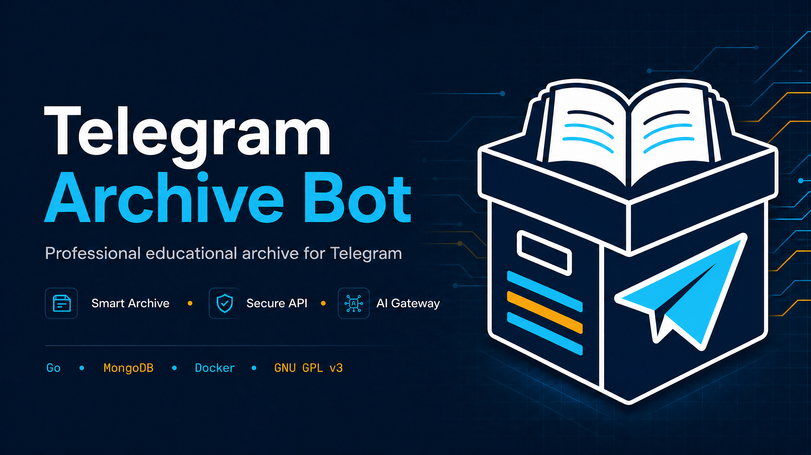

# Telegram Archive Bot

A production-oriented Telegram archive bot for organizing educational documents, media, and shared resources in MongoDB and Telegram. The bot provides structured categories and subjects, administrator workflows, media-aware downloads, secure share links, broadcast tools, an authenticated HTTP API, and an OpenAI-compatible AI gateway.

> The bot preserves Telegram as the delivery layer while MongoDB stores metadata, permissions, counters, and operational state.

## Visual identity




The project uses a focused visual system built around deep navy, cyan, and amber. Feature icons and the Instagram announcement artwork are available in the project asset library:

| Asset | Purpose |
|---|---|
| [Repository preview](assets/branding/telegram-archive-repository-preview.png) | GitHub repository header and project overview |
| [Project logo](assets/branding/telegram-archive-logo.png) | Main repository and bot identity |
| [Secure API + AI icon](assets/branding/telegram-archive-api-icon.png) | API and AI gateway materials |
| [Instagram post](assets/branding/telegram-archive-instagram-post.png) | Ready-to-publish project announcement |

## Capabilities

| Area | Capability |
|---|---|
| Archive | Categories, subjects, ordered files, metadata, download counters |
| Delivery | All archived media, including images, is sent as a Telegram document to preserve the original file |
| Administration | Role-based permissions, content management, user moderation, maintenance mode, welcome settings, audit logs |
| Sharing | Expiring deep links backed by cryptographically random tokens |
| API | API-key authentication, rate limiting, archive reads, bundle delivery, and AI routes |
| AI | OpenAI-compatible chat and summarization gateway plus `/ai` and `/summarize` bot commands |
| Operations | Health endpoint, Docker image, Compose configuration, request IDs, race-detector coverage |

## Architecture

The application is a Go service with clear boundaries between Telegram handlers, archive services, persistence, API routes, keyboards, models, and utility functions.


The complete explanation is available in [`docs/architecture.md`](./docs/architecture.md), with an editable source in [`docs/architecture.mmd`](./docs/architecture.mmd).

```text
Telegram Updates
      |
      v
  handlers  -----> services -----> MongoDB
      |                 |
      |                 +--------> Telegram Bot API
      |

HTTP clients ---> authenticated API ---> archive / bundle / AI services
```

The bot and API run in the same process. The HTTP server listens on `PORT` and exposes a public health endpoint together with authenticated API routes.

## Requirements

You need Go 1.23 or newer, MongoDB, a Telegram bot token, and an archive channel where the bot can post files. Docker is the recommended deployment path.

## Configuration

Copy `.env.example` to `.env` for local development. Never commit `.env` or real credentials.

| Variable | Required | Description |
|---|---:|---|
| `BOT_TOKEN` | Yes | Telegram BotFather token |
| `OWNER_ID` | Yes | Numeric Telegram ID of the owner |
| `ARCHIVE_CHANNEL_ID` | Yes | Channel ID used for archived media |
| `MONGO_URI` | Yes | MongoDB connection string |
| `DB_NAME` | No | Database name; defaults to `telegram_archive_db` |
| `PORT` | No | HTTP port; defaults to `8000` |
| `API_KEY` | Recommended | Secret for protected HTTP API routes |
| `API_RATE_LIMIT` | No | Requests per API key per minute; defaults to `60` |
| `AI_BASE_URL` | No | OpenAI-compatible API base URL |
| `AI_API_KEY` | No | AI provider key; server-side only |
| `AI_MODEL` | No | AI model name; defaults to `gpt-5-mini` |
| `AI_REQUEST_TIMEOUT_SECONDS` | No | AI request timeout |
| `BROADCAST_DELAY` | No | Delay between broadcast messages |
| `CACHE_TTL_SECONDS` | No | Archive cache lifetime |

## Local development

```bash
git clone https://github.com/alihaidershakermax/telegram-archive-bot.git
cd telegram-archive-bot
cp .env.example .env
# edit .env with real values
go mod download
go run .
```

The health endpoint is available at `GET /api/v1/health`. A successful response looks like:

```json
{"status":"ok","service":"telegram-archive-bot"}
```

## Bot commands

| Command | Description |
|---|---|
| `/start` | Open the archive menu |
| `/panel` | Open the administrator panel when authorized |
| `/broadcast` | Send a broadcast when the `broadcast` permission is granted |
| `/ban <id>` | Ban a user when authorized |
| `/unban <id>` | Remove a user ban when authorized |
| `/ai <question>` | Ask the configured AI gateway |
| `/summarize <text>` | Summarize text through the configured AI gateway |

## HTTP API

Protected routes require either `X-API-Key: <API_KEY>` or `Authorization: Bearer <API_KEY>`.

```text
GET  /api/v1/health
GET  /api/v1/categories
GET  /api/v1/subjects?category_id=1
GET  /api/v1/files?subject_id=1
POST /api/v1/bundle
POST /api/v1/ai/chat
POST /api/v1/ai/summarize
```

The bundle route accepts `{"file_ids":[1,2]}` and requires `X-Telegram-User-ID`. It enforces a maximum of 20 files and a 100 MB generated bundle limit, then sends the ZIP to that Telegram user.

Example:

```bash
curl -H "X-API-Key: $API_KEY" \
  "http://localhost:8000/api/v1/categories"

curl -X POST \
  -H "X-API-Key: $API_KEY" \
  -H "X-Telegram-User-ID: 123456789" \
  -H "Content-Type: application/json" \
  -d '{"file_ids":[12,13]}' \
  "http://localhost:8000/api/v1/bundle"
```

## Docker and Koyeb

The included multi-stage Dockerfile builds a static Go binary in a minimal runtime image. Set all environment variables as Koyeb Secrets or environment variables, especially `BOT_TOKEN`, `MONGO_URI`, `API_KEY`, and `AI_API_KEY`.

```bash
docker compose up --build -d
docker compose logs -f bot
```

The process listens on the platform-provided `PORT`. Do not hardcode a production port or place secrets in the Dockerfile.

For Telegram long polling, configure Koyeb with `Minimum instances = 1`, disable Scale-to-Zero, and set the HTTP health check to `GET /healthz`. This keeps the controller and managed workers alive between incoming HTTP requests.

For Telegram long polling, configure the Koyeb Service with **at least one permanent instance** (`Minimum instances = 1`) and disable Scale-to-Zero. A polling bot does not receive regular public HTTP traffic, so an idle policy can stop its process and interrupt updates. Configure the HTTP health check as `GET /healthz` on the exposed `PORT`, with a startup grace period long enough for MongoDB and Telegram initialization. The endpoint is intentionally public, lightweight, and independent of database readiness.

## Bot Factory and API v2

Bot Factory lets authorized operators register Telegram bot tokens that they already created through BotFather. The service validates each token with Telegram, encrypts it with AES-256-GCM before persistence, keeps only safe metadata in API responses, and starts an isolated long-polling worker for each active bot. Use `/newbot` and `/mybots` in Telegram, or the authenticated API v2 routes below.

Set `FACTORY_ENCRYPTION_KEY` to a random 32-byte key encoded as 64 hexadecimal characters or base64. Never reuse `API_KEY`, never commit the value, and rotate it only through a planned re-encryption migration. `FACTORY_MAX_BOTS_PER_OWNER` limits registrations and `FACTORY_WORKERS` documents the worker capacity for future queued jobs.

```bash
curl -H "X-API-Key: $API_KEY" http://localhost:8000/api/v2/bots
curl -X POST -H "X-API-Key: $API_KEY" -H "Content-Type: application/json" \\
  -d '{"token":"123456:REDACTED"}' \\
  http://localhost:8000/api/v2/bots
curl -H "X-API-Key: $API_KEY" http://localhost:8000/api/v2/router/best
curl -X POST -H "X-API-Key: $API_KEY" http://localhost:8000/api/v2/bots/<id>/pause
curl -X POST -H "X-API-Key: $API_KEY" http://localhost:8000/api/v2/bots/<id>/resume
curl -X DELETE -H "X-API-Key: $API_KEY" http://localhost:8000/api/v2/bots/<id>
```

The routing score prefers active bots with recent health, low observed latency, fewer active requests, and fewer consecutive errors. Telegram update streams remain isolated by token; the router selects a healthy bot for factory-managed jobs rather than attempting to merge Telegram sessions.

## Lightweight Group Support

يمكن للبوت العمل داخل المجموعات مع إعدادات معزولة حسب `bot_id` و`chat_id`. الأمر `/group` يعرض حالة المجموعة ويهيئ سجلها داخل namespace البوت الحالي، بينما تبقى عمليات الملفات خلف Storage Gateway الخاص بالبوت الأب.

تتوفر إعدادات المجموعة عبر API v2 المصادق عليه:

```bash
curl -H "X-API-Key: $API_KEY" \
  -H "X-Telegram-Bot-ID: 123456789" \
  https://example.com/api/v2/groups/-1001234567890

curl -X PATCH -H "X-API-Key: $API_KEY" \
  -H "X-Telegram-Bot-ID: 123456789" \
  -H "Content-Type: application/json" \
  -d '{"enabled":true,"admins_only":true}' \
  https://example.com/api/v2/groups/-1001234567890
```

يجب أن يكون `chat_id` رقماً سالباً للمجموعات، وأن يطابق `X-Telegram-Bot-ID` namespace البوت المطلوب. مفاتيح API المقيّدة لا تتجاوز bot scope الخاص بها، وتستخدم `archive:read` للقراءة و`archive:write` للتعديل.

## Security and reliability

The API uses constant-time API-key comparison and per-key rate limiting. Share tokens use random values and expire. Administration routes apply permission checks before content, user, broadcast, or settings operations.

Telegram and MongoDB errors should be logged server-side with context while user-facing messages remain generic. The repository includes race-detector and static-analysis checks for the main packages.

## Testing

Run the complete Go verification suite before submitting changes:

```bash
gofmt -w .
go test ./...
go test -race ./...
go vet ./...
git diff --check
```

API tests cover health, authentication, bundle validation, delivery failure handling, ZIP creation, and Telegram-download status handling. Utility tests cover image detection and file classification.

## Project layout

```text
api/       Authenticated HTTP API and bundle delivery
ai/        OpenAI-compatible gateway
config/    Environment configuration
db/        MongoDB connection, indexes, and counters
handlers/  Telegram commands, callbacks, uploads, and AI
keyboards/ Inline Telegram keyboards
models/    MongoDB and in-memory state models
services/  Archive, users, admins, sharing, broadcast, and rating
utils/     File classification and Telegram message helpers
```

## Operational notes

The bot must be an administrator in the archive channel with permission to post media. Archive downloads are always sent as Telegram documents so image files preserve their original downloadable form. MongoDB should use indexes for file name, subject, upload date, and download count as the archive grows.

## License

This project is licensed under the **GNU General Public License v3.0 only**. See [`LICENSE`](./LICENSE) for the full license text. The official license reference is available at [GNU GPL v3](https://www.gnu.org/licenses/gpl-3.0.html).
