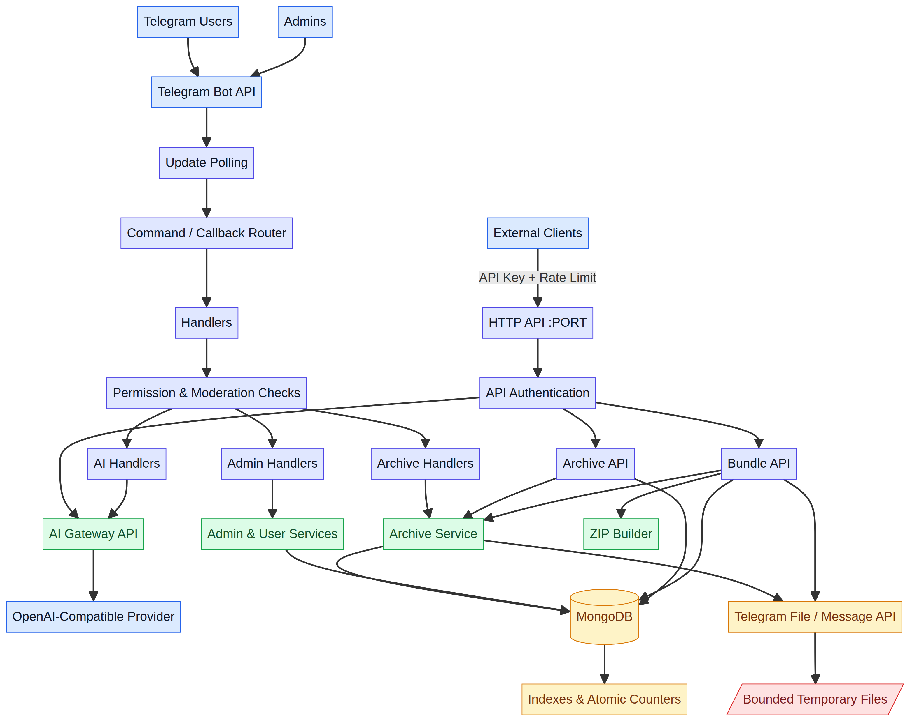

# Telegram Archive Bot

A production-oriented Telegram archive bot for organizing educational documents, media, and shared resources in MongoDB and Telegram. The bot provides structured categories and subjects, administrator workflows, media-aware downloads, secure share links, broadcast tools, an authenticated HTTP API, and an OpenAI-compatible AI gateway.

> The bot preserves Telegram as the delivery layer while MongoDB stores metadata, permissions, counters, and operational state.

## Capabilities

| Area | Capability |
|---|---|
| Archive | Categories, subjects, ordered files, metadata, download counters |
| Delivery | Photos are sent as Telegram photos; documents, video, audio, voice, animations, and other media retain suitable delivery types |
| Administration | Role-based permissions, content management, user moderation, maintenance mode, welcome settings, audit logs |
| Sharing | Expiring deep links backed by cryptographically random tokens |
| API | API-key authentication, rate limiting, archive reads, bundle delivery, and AI routes |
| AI | OpenAI-compatible chat and summarization gateway plus `/ai` and `/summarize` bot commands |
| Search | Advanced metadata search with filters, sorting, pagination, and Telegram/API access |
| Operations | Health endpoint, Docker image, Compose configuration, request IDs, race-detector coverage |

## Architecture

The application is a Go service with clear boundaries between Telegram handlers, archive services, persistence, API routes, keyboards, models, and utility functions.



The complete explanation is available in [`docs/architecture.md`](./docs/architecture.md), with an editable source in [`docs/architecture.mmd`](./docs/architecture.mmd).

```text
Telegram Updates
      |
      v
  handlers  -----> services -----> MongoDB
      |                 |
      |                 +--------> Telegram Bot API
      |
      +---- /search --> advanced archive search

HTTP clients ---> authenticated API ---> archive / bundle / AI services
```

The bot and API run in the same process. The HTTP server listens on `PORT` and exposes a public health endpoint together with authenticated API routes.

## Requirements

You need Go 1.23 or newer, MongoDB, a Telegram bot token, and an archive channel where the bot can post files. Docker is the recommended deployment path.

## Configuration

Copy `.env.example` to `.env` for local development. Never commit `.env` or real credentials.

| Variable | Required | Description |
|---|---:|---|
| `BOT_TOKEN` | Yes | Telegram BotFather token |
| `OWNER_ID` | Yes | Numeric Telegram ID of the owner |
| `ARCHIVE_CHANNEL_ID` | Yes | Channel ID used for archived media |
| `MONGO_URI` | Yes | MongoDB connection string |
| `DB_NAME` | No | Database name; defaults to `telegram_archive_db` |
| `PORT` | No | HTTP port; defaults to `8000` |
| `API_KEY` | Recommended | Secret for protected HTTP API routes |
| `API_RATE_LIMIT` | No | Requests per API key per minute; defaults to `60` |
| `AI_BASE_URL` | No | OpenAI-compatible API base URL |
| `AI_API_KEY` | No | AI provider key; server-side only |
| `AI_MODEL` | No | AI model name; defaults to `gpt-5-mini` |
| `AI_REQUEST_TIMEOUT_SECONDS` | No | AI request timeout |
| `BROADCAST_DELAY` | No | Delay between broadcast messages |
| `CACHE_TTL_SECONDS` | No | Archive cache lifetime |

## Local development

```bash
git clone https://github.com/alihaidershakermax/telegram-archive-bot-py.git
cd telegram-archive-bot-py
cp .env.example .env
# edit .env with real values
go mod download
go run .
```

The health endpoint is available at `GET /api/v1/health`. A successful response looks like:

```json
{"status":"ok","service":"telegram-archive-bot"}
```

## Bot commands

| Command | Description |
|---|---|
| `/start` | Open the archive menu |
| `/panel` | Open the administrator panel when authorized |
| `/broadcast` | Send a broadcast when the `broadcast` permission is granted |
| `/ban <id>` | Ban a user when authorized |
| `/unban <id>` | Remove a user ban when authorized |
| `/ai <question>` | Ask the configured AI gateway |
| `/summarize <text>` | Summarize text through the configured AI gateway |
| `/search` | Search the archive with advanced filters |

### Advanced search

Use `/search` and send a phrase with optional filters. Search terms are matched against file names, file types, and subject names. Results are paginated and can be sorted by newest, oldest, download count, or name.

```text
/search
تشريح النوع:pdf الترتيب:الأكثر_تنزيلاً
```

The API exposes the same capability through `GET /api/v1/search`. Supported query parameters include `q`, `category_id`, `subject_id`, `file_type`, `from`, `to`, `sort`, `page`, and `limit`.

## HTTP API

Protected routes require either `X-API-Key: <API_KEY>` or `Authorization: Bearer <API_KEY>`.

```text
GET  /api/v1/health
GET  /api/v1/categories
GET  /api/v1/subjects?category_id=1
GET  /api/v1/files?subject_id=1
GET  /api/v1/search?q=تشريح&file_type=pdf&sort=downloads&page=0&limit=10
POST /api/v1/bundle
POST /api/v1/ai/chat
POST /api/v1/ai/summarize
```

The bundle route accepts `{"file_ids":[1,2]}` and requires `X-Telegram-User-ID`. It enforces a maximum of 20 files and a 100 MB generated bundle limit, then sends the ZIP to that Telegram user.

Example:

```bash
curl -H "X-API-Key: $API_KEY" \
  "http://localhost:8000/api/v1/categories"

curl -X POST \
  -H "X-API-Key: $API_KEY" \
  -H "X-Telegram-User-ID: 123456789" \
  -H "Content-Type: application/json" \
  -d '{"file_ids":[12,13]}' \
  "http://localhost:8000/api/v1/bundle"
```

## Docker and Koyeb

The included multi-stage Dockerfile builds a static Go binary in a minimal runtime image. Set all environment variables as Koyeb Secrets or environment variables, especially `BOT_TOKEN`, `MONGO_URI`, `API_KEY`, and `AI_API_KEY`.

```bash
docker compose up --build -d
docker compose logs -f bot
```

The process listens on the platform-provided `PORT`. Do not hardcode a production port or place secrets in the Dockerfile.

## Security and reliability

The API uses constant-time API-key comparison and per-key rate limiting. Share tokens use random values and expire. Search uses escaped regular expressions, bounded pagination, validated filters, and server-side sorting. Administration routes apply permission checks before content, user, broadcast, or settings operations.

Telegram and MongoDB errors should be logged server-side with context while user-facing messages remain generic. The repository includes race-detector and static-analysis checks for the main packages.

## Testing

Run the complete Go verification suite before submitting changes:

```bash
gofmt -w .
go test ./...
go test -race ./...
go vet ./...
git diff --check
```

API tests cover health, authentication, bundle validation, delivery failure handling, ZIP creation, and Telegram-download status handling. Utility tests cover image detection and file classification.

## Project layout

```text
api/       Authenticated HTTP API and bundle delivery
ai/        OpenAI-compatible gateway
config/    Environment configuration
db/        MongoDB connection, indexes, and counters
handlers/  Telegram commands, callbacks, uploads, AI, and advanced search
keyboards/ Inline Telegram keyboards
models/    MongoDB and in-memory state models
services/  Archive, users, admins, sharing, broadcast, rating, and search
utils/     File classification and Telegram message helpers
```

## Operational notes

The bot must be an administrator in the archive channel with permission to post media. MongoDB should use indexes for file name, type, subject, upload date, and download count as the archive grows. Search pagination remains bounded to protect the bot and API under load.

## License

No license has been declared yet. Add an explicit license before distributing the project publicly or accepting external contributions.
